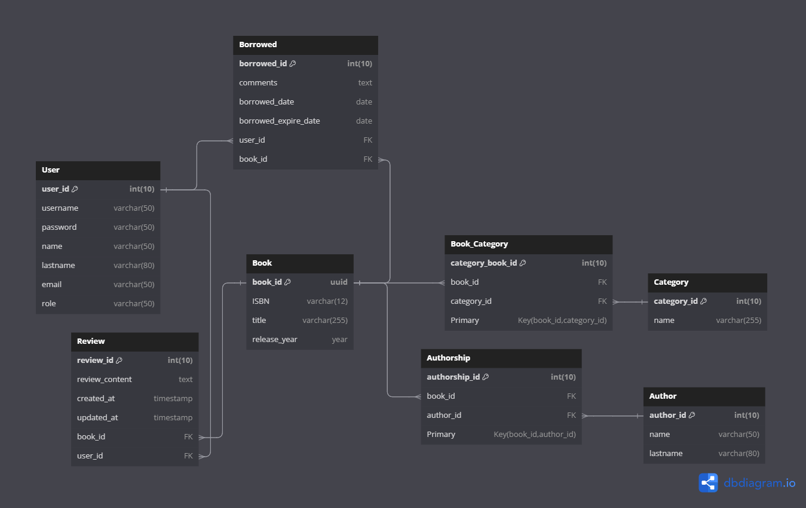

# Tarea 3: Diagramación y Modelado de Datos

**Descripción:**
Diseña un diagrama de entidad-relación (DER) para un sistema de gestión de biblioteca que incluya las entidades principales y sus relaciones.

**Requerimientos:**
Utiliza una herramienta de diseño de diagramas de tu elección (por ejemplo, Lucidchart, Draw.io, etc.).
Identifica al menos tres entidades principales y sus atributos.
Establece relaciones entre las entidades (uno a uno, uno a muchos, muchos a muchos).
Asegúrate de que el diagrama sea claro y fácil de entender.
Proporciona una breve explicación de las decisiones de diseño que tomaste.

